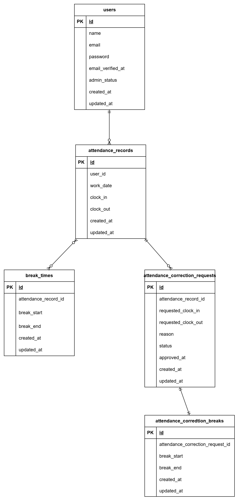

# attendance-app

## 概要

企業向けの勤怠管理アプリです。
従業員は出勤・退勤・休憩時間の打刻や勤怠修正申請を行うことができ、
管理者は勤怠情報の確認や修正申請の承認を行うことができます。

## 目的

勤怠管理業務をWebアプリケーション上で効率的に管理できるシステムを
構築すること。

## 機能一覧

### 一般ユーザー

- 会員登録
- メール認証
- ログイン / ログアウト
- 出勤打刻
- 退勤打刻
- 休憩開始 / 休憩終了
- 勤怠一覧表示（月別）
- 勤怠詳細表示
- 勤怠修正申請
- 修正申請一覧表示

### 管理者

- 管理者ログイン
- 日次勤怠一覧表示
- スタッフ一覧表示
- 勤怠詳細表示
- 修正申請一覧表示
- 修正申請承認
- CSV出力

## 画面一覧

### 一般ユーザー

- ログイン画面
- 会員登録画面
- 勤怠打刻画面
- 勤怠一覧画面
- 勤怠詳細画面
- 修正申請一覧画面

### 管理者

- ログイン画面
- 日次勤怠一覧画面
- スタッフ一覧画面
- 勤怠詳細画面
- 修正申請一覧画面

## 使用技術

- PHP 8.1.34
- Laravel 10.50.2
- MySQL 8.0
- Docker
- Blade
- Laravel Fortify (認証・メール認証)
- PHPUnit

## 環境構築

### Dockerコンテナ起動

```
git clone https://github.com/ma-in-ko/attendance-app.git
cd attendance-app
docker compose up -d --build
```

### Laravelセットアップ

以下のコマンドは、PHPコンテナ内で実行してください。

```
docker compose exec php bash
cd src
composer install
cp .env.example .env
php artisan key:generate

```

.env ファイルに以下を設定してください

```
DB_CONNECTION=mysql
DB_HOST=mysql
DB_PORT=3306
DB_DATABASE=laravel_db
DB_USERNAME=laravel_user
DB_PASSWORD=laravel_pass
```

```
MAIL_MAILER=smtp
MAIL_HOST=mailhog
MAIL_PORT=1025
MAIL_USERNAME=null
MAIL_PASSWORD=null
MAIL_ENCRYPTION=null
MAIL_FROM_ADDRESS=test@example.com
MAIL_FROM_NAME="${APP_NAME}"
```

### マイグレーション

```
php artisan migrate:fresh --seed
```

## 認証機能

本アプリではLaravel Fortifyを使用して認証機能を実装しています。

### 実装内容

- 会員登録
- メール認証
- ログイン
- ログアウト
- 管理者ログイン

### メール認証 (開発環境)

開発環境ではMailHog を利用しています。

メール認証を行う場合は以下へアクセスしてください。

- MailHog : `http://localhost:8025`

### バリデーション

FormRequestを使用してバリデーションを実装しています。

## API

Laravel Sanctumを使用した公開APIを実装しています。

### エンドポイント

| Method | URI | 説明 | 認証 |
|---|---|---|---|
| GET | /api/v1/attendance-records | 勤怠一覧取得 | 不要 |
| GET | /api/v1/attendance-records/{attendanceRecord} | 勤怠詳細取得 | 不要 |
| POST | /api/v1/attendance-records | 勤怠登録 | 必須 |
| PUT/PATCH | /api/v1/attendance-records/{attendanceRecord} | 勤怠更新 | 必須 |
| DELETE | /api/v1/attendance-records/{attendanceRecord} | 勤怠削除 | 必須 |

### API 機能

- 勤怠一覧の取得
- ユーザーID・日付・年月による絞り込み
- ページネーション
- 勤怠詳細の取得
- 勤怠の登録・更新・削除
- バリデーションエラーのJSONレスポンス
- SanctumによるAPIトークン認証
- Policyによる操作権限の制御
- API Resourceによるレスポンス整形
- API用FormRequestによるバリデーション

### API認証

書き込み系API (POST / PUT / DELETE)はSanctumによるBearerトークン認証が必要です。

Authorizationヘッダーには以下の形式でトークンを指定します。

```text
Authorization: Bearer {token}
```

### APIテスト

Postmanを使用してAPIの動作確認を実施しています。

- GET：勤怠一覧取得
- GET：勤怠詳細取得
- GET：存在しないIDの404エラー
- POST：勤怠登録
- POST：バリデーションエラー
- PUT：勤怠更新
- PUT：存在しないIDの404エラー
- PUT：権限のない勤怠への操作で403エラー
- DELETE：勤怠削除
- DELETE：存在しないIDの404エラー
- 未認証時の401エラー
- user_idによる絞り込み
- dateによる絞り込み
- monthによる絞り込み
- ページネーション

## マイ勤怠レポート

認証ユーザー向けに、勤怠データを集計したマイ勤怠レポートを表示します。

- 総労働時間
- 総残業時間
- 平均労働時間
- 遅刻回数
- 早退回数
- 長時間労働回数
- 月別の勤務時間・残業時間

未認証ユーザーがアクセスした場合は、ログイン画面へリダイレクトします。

## テスト用アカウント

### 一般ユーザー

| メールアドレス    | パスワード |
| ----------------- | ---------- |
| user1@example.com | password   |
| user2@example.com | password   |

### 管理者

| メールアドレス   | パスワード |
| ---------------- | ---------- |
| user@example.com | password   |

## テスト

PHPUnitを用いて単体テストを実施しています。

```
docker compose exec php php artisan test
```

特定のテストのみ実行する場合

```
php artisan test --filter=テスト名
```

で実行できます。

## 開発環境URL

- アプリ： http://localhost
- MailHog : http://localhost:8025
- phpMyAdmin： http://localhost:8080

## ER図



## 工夫した点

- Laravel Fortifyを利用して認証・メール認証機能を実装
- 出勤・退勤・休憩状態を画面上でわかりやすく表示
- 勤怠修正申請と承認機能を実装し、実際の業務を意識した設計
- リレーションを活用し、勤怠・休憩・修正申請を適切に管理
- Bladeテンプレートを利用し、画面ごとにレイアウトを共通化
- スタッフごとの勤怠情報をCSV形式で出力できるように実装

## 作者

中尾 麻衣子
